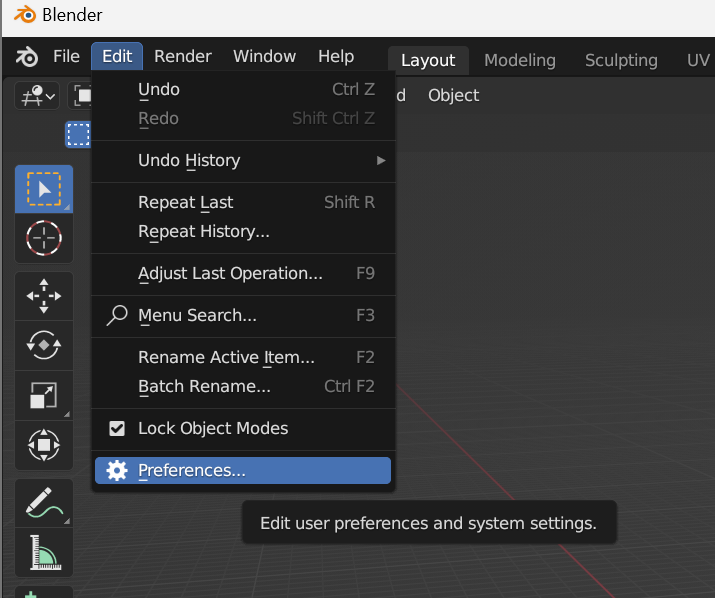
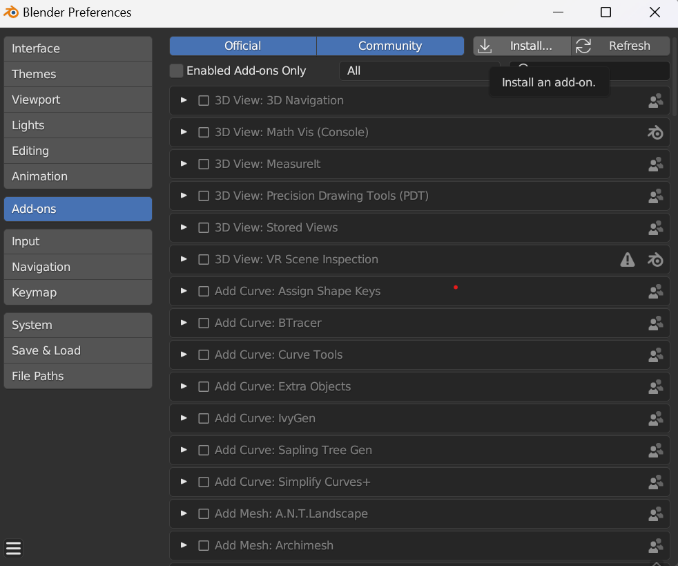
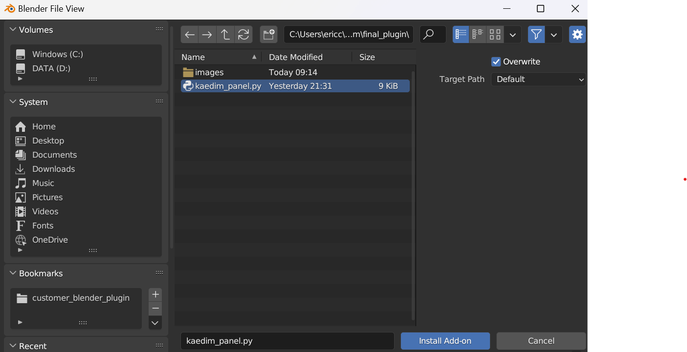
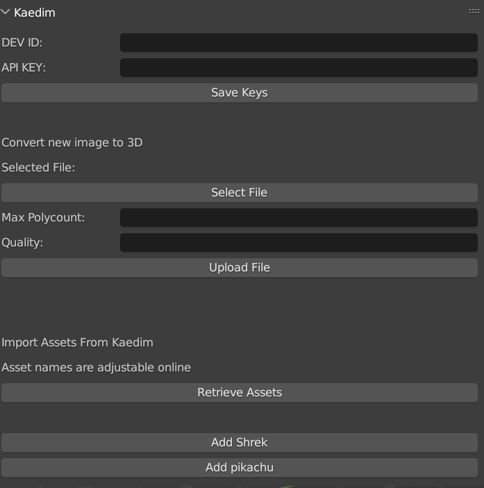

### Installation Guide (with images)
- Download the `kaedim_panel.py` file from this repository
- You can do so by either downloading the entire repository through Code -> Download ZIP or by clicking into the file and clicking the download icon in the top right
- Navigate to Blender -> Edit -> Preferences -> Add-Ons -> Install
- Select the `kaedim_panel.py` file you just downloaded
- Click the checkbox on the new Kaedim add-on that shows up
- You're all good to go!
- Alternatively: you can copy-paste the code from kaedim_panel.py into a Blender Scripting Workspace. Once you run the script, the Kaedim Panel will work as expected
  

### Usage Guide
- You can find the Kaedim panel in the N-Panels. Simply press the `N` key within blender and the display will appear
- You'll need to enter your Dev ID and API Key to continue, you can find these on your account at https://www.app.kaedim3d.com/settings?tab=api
- Paste these keys into the interface and press `Save Keys`
- Once you've registered your Dev ID and API Key, you can upload new assets through the N Panel. Simply click through the options, specifying your desired image, maximum polycount, and desired image quality. Once you are ready, you can start processing the file by clicking the `Upload File` button.
- At any time, you can retrieve your existing assets and import them directly into blender
- Click the `Retrieve Assets` button, and new buttons will appear for each model you have in your account. You can click the corresponding button to display these models within the blender layout workspace.
- The names of your assets can be updated on the web portal
- All the input boxes will have additional information that is available on hover

